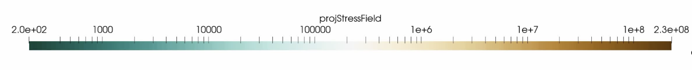
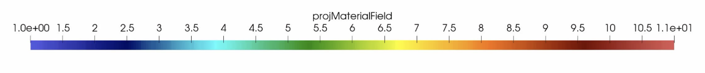

# Dynamics of arc-continent collision: the role of lithospheric-mantle dynamics on controlling the evolution of stress regime

## Abstract 

Arc-continent collision is a multi-stage process where the intra-oceanic crust collides with a continental margin and contributes to the growth of the continental crust. We explored the link between compositional density contrasts, lithospheric-deep mantle dynamics and the evolution of the stress regime during and after arc-continent collision. We performed a series of simulations only varying the arc thickness as it controls the buoyancy of intra-oceanic arcs. Therefore, we investigated a range of density contrasts between the colliding arc and the continental plate. Modelling results show that arc-continent collision is followed by one of two dynamic mechanisms: (i) slab-anchoring and arc transference in dense arcs where the density contrast is larger than -3% (15-31 km in thickness); and (ii) slab break-off in buoyant arcs where the density contrast is less than -3% (32-35 km in thickness). We conclude that the large-scale mantle return flow emerged from slab-anchoring facilitates the simultaneous occurrence of compression and extension by enhancing: (i) compression and thickening of the buoyant intra-oceanic arc crust; and (ii) the buoyancy anomaly that triggers the release of a gravitational flow. The results of our numerical modelling highlight the importance of lithospheric-mantle dynamics on controlling the spatio-temporal evolution of stress in arc-continent collision settings. The dynamic interplay between arc-continent collision and lithospheric mantle dynamics documented in this paper has broader implications in the understanding of long-lived geodynamic scenarios such as the closure of ocean basins where arc-continent collision often occurs.

### This Repository:

Contains the original notebooks  scripts used to ran the numerical simulations presented in the paper: "Dynamics of arc-continent collision: the role of lithospheric-mantle dynamics on controlling the evolution of stress regime", within the folder "Arc-continent collision". Additionally, it contains the measured kinematics and viscous dissipation data within the "Kinematics_data" and "Viscouss_dissipation_data", that can be processed with the scripts within the folder "Scripts for creating figures".
