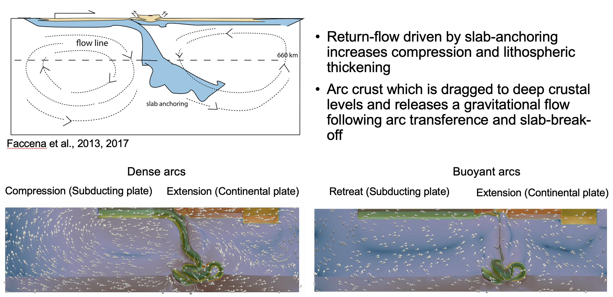

# Dynamics of arc-continent collision: the role of lithospheric-mantle dynamics on controlling the evolution of stress regime

## Abstract 

We investigate how the mechanical properties of intra-oceanic arcs affect the collision style and associated stress-strain evolution with buoyancy-driven models of subduction that accurately reproduce the dynamic interaction of the lithosphere and mantle. We performed a series of simulations only varying the effective arc thickness as it controls the buoyancy of intra-oceanic arcs. Our simulations spontaneously evolve into two contrasting styles of collision that are controlled by a 3% density contrast between the arc and the continental plate. In simulations with less buoyant arcs (15-31 km; effective thickness), we observe arc-transference to the overriding plate and slab-anchoring and folding at the 660 km transition zone that result in fluctuations in the slab dip, strain-stress regime, surface kinematics, and viscous dissipation. After slab-folding occurs, the gravitational potential energy is dissipated in the form of lithospheric flow causing lithospheric extension in the overriding plate. Conversely, simulations with more buoyant arcs (32-35 km; effective thickness) do not lead to arc-transference and result in slab break-off, which causes an asymptotic trend in surface kinematics, viscous dissipation and strain-stress regime, and lithospheric extension in the overriding plate. The results of our numerical modelling highlight the importance of slab-anchoring and folding in the 660 km transition zone on increasing the coupling of the subduction system.

### This Repository:

Contains the original notebooks  scripts used to ran the numerical simulations presented in the paper: "Dynamics of arc-continent collision: the role of lithospheric-mantle dynamics on controlling the evolution of stress regime", within the folder "Arc-continent collision". Additionally, it contains the measured surface kinematics, slab dip, strain_rate tensor at the surface, and viscous dissipation data. These data can be found within the "Kinematics_data", "Slab_dipData", "Deviatoric_stress_strain" and "Viscous_dissipation_data", that can be processed with the scripts within the folder "Scripts for creating figures".
