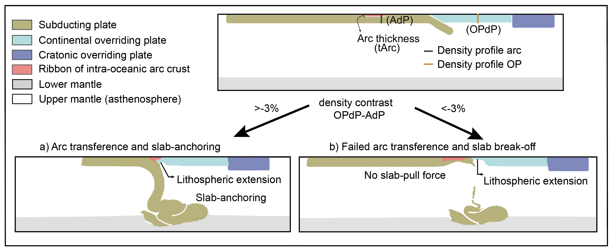

# Dynamics of arc-continent collision: the role of lithospheric-mantle dynamics on controlling the evolution of stress regime

## Abstract 

Arc-continent collision is a multi-stage process where the first-order controls affecting the wide range of collisional styles remain poorly understood. We investigate how the mechanical properties of intra-oceanic arcs affect the collision style and associated stress-strain evolution by using a buoyancy-driven subduction system that captures lithospheric-mantle dynamics. We performed a series of simulations only varying the effective arc thickness as it controls the buoyancy of intra-oceanic arcs. Our simulations evolve into two contrasting styles of collision that are controlled by the arc buoyancy. In simulations with dense arcs (15-31 km in effective thickness), we observe arc transference and slab-anchoring in the 660 km transition zone as well as fluctuations in the strain-stress regime, subduction velocity, slab dip and viscous dissipation. The fluctuations in the strain-stress regime are driven by slab-folding episodes, where the potential energy that drives the slab-pull force increases and causes compression. After slab-folding occurs, the gravitational potential energy is dissipated in the form of  crustal-lithospheric flow causing extension in the overriding plate. Conversely, simulations with buoyant arcs (32-35 km in effective thickness) do not lead to arc-transference and result in slab break-off, which controls the asymptotic trend in the subduction velocity, viscous dissipation and extension in the overriding plate. The difference in the collisional style can be explained by a 3% density contrast between the intra-oceanic arc and the continental plate. The results of our numerical modelling highlight the importance of lithospheric-mantle dynamics on controlling the strain-stress evolution in arc-continent collision settings, by increasing the coupling of the surface-lithosphere-mantle subduction system.

### This Repository:

Contains the original notebooks  scripts used to ran the numerical simulations presented in the paper: "Dynamics of arc-continent collision: the role of lithospheric-mantle dynamics on controlling the evolution of stress regime", within the folder "Arc-continent collision". Additionally, it contains the measured kinematics and viscous dissipation data within the "Kinematics_data" and "Viscous_dissipation_data", that can be processed with the scripts within the folder "Scripts for creating figures".
